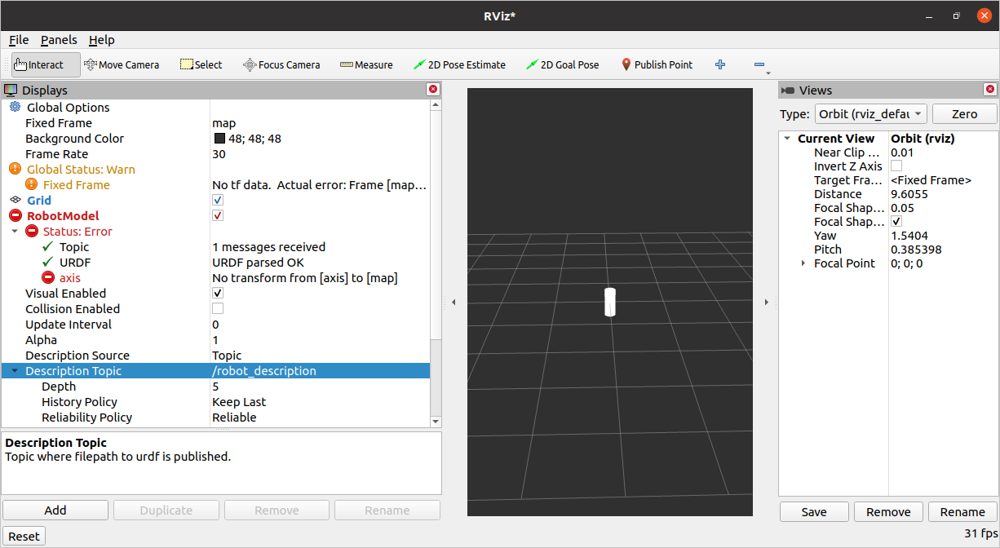
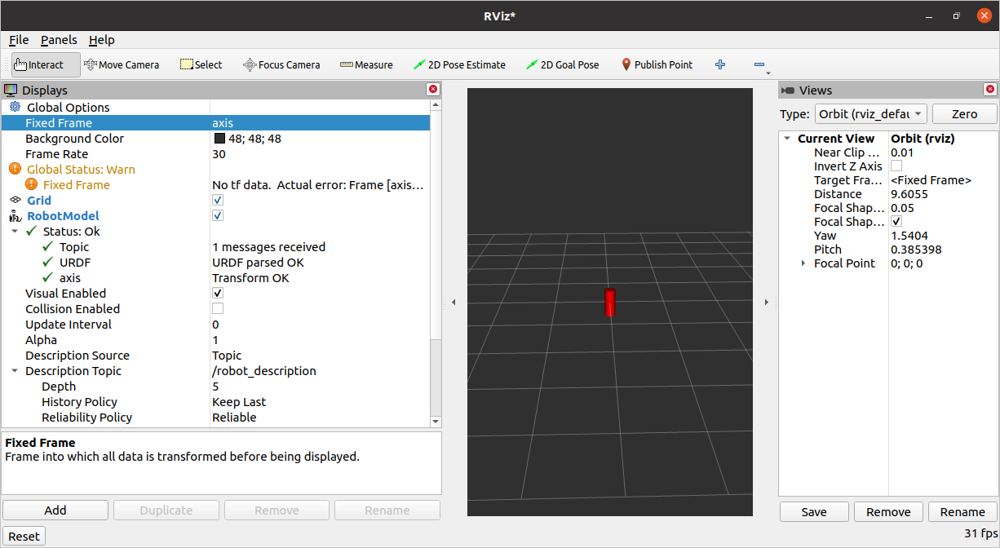

Playing with URDF
=================

.. contents:: Table of Contents
   :depth: 2
   :local:
   
   
Playing with URDF 

1 info
^^^^^^

https://docs.ros.org/en/galactic/Tutorials/URDF/Using-URDF-with-Robot-State-Publisher.html

2 Source the setup files
^^^^^^^^^^^^^^^^^^^^^^^^

You should know, or ???

3 Create package
^^^^^^^^^^^^^^^^

cd ~/dev_ws/src
ros2 pkg create playing_with_urdf --build-type ament_python --dependencies rclpy
cd urdf_tutorial

4 Create local git repo
^^^^^^^^^^^^^^^^^^^^^^^

git init
git add .

5 Add local git repo to eclipse
^^^^^^^^^^^^^^^^^^^^^^^^^^^^^^^

check other tutorial

6 Import local git repo to eclipse as Project
^^^^^^^^^^^^^^^^^^^^^^^^^^^^^^^^^^^^^^^^^^^^^

check other tutorial

7 Create urdf directory
^^^^^^^^^^^^^^^^^^^^^^^

Create directory named "urdf"

7 Create urdf file
^^^^^^^^^^^^^^^^^^

Inside this folder we create a file called x.urdf.xml. Where "x" could be everything.
E.g. call it myRobot.urdf.xml .

Write inside this

.. code-block:: C++

<robot name="myRobot">
   <link name="axis">
      <visual>
         <origin xyz="0 0 0" rpy="0 0 0"/>
         <geometry>
            <cylinder radius="0.1" length=".5"/>
         </geometry>
         <material name="red">
            <color rgba="1 0 0 1"/>
         </material>
      </visual>
   </link>
</robot>

8 Create launch directory
^^^^^^^^^^^^^^^^^^^^^^^^^

Create directory named "launch"

9 Create launch file
^^^^^^^^^^^^^^^^^^^^

Create inside "launch" directory, the file demo.launch.py and add this.

.. code-block:: C++

   import os
   from ament_index_python.packages import get_package_share_directory
   from launch import LaunchDescription
   from launch.actions import DeclareLaunchArgument
   from launch.substitutions import LaunchConfiguration
   from launch_ros.actions import Node
   
   def generate_launch_description():
   
       use_sim_time = LaunchConfiguration('use_sim_time', default='false')
   
       urdf_file_name = 'myRobot.urdf.xml'
       urdf = os.path.join(
           get_package_share_directory('playing_with_urdf'),
           urdf_file_name )
       with open(urdf, 'r') as infp:
           robot_desc = infp.read()
   
       return LaunchDescription([
           DeclareLaunchArgument(
               'use_sim_time',
               default_value='false',
               description='Use simulation (Gazebo) clock if true'),
           Node(
               package='robot_state_publisher',
               executable='robot_state_publisher',
               name='robot_state_publisher',
               output='screen',
               parameters=[{'use_sim_time': use_sim_time, 'robot_description': robot_desc}],
               arguments=[urdf]),
       ])

10 Edit setup.py
^^^^^^^^^^^^^^^^

::

   import os
   from glob import glob
   from setuptools import setup
   from setuptools import find_packages
   
   package_name = 'playing_with_urdf'
   
   setup(
       name=package_name,
       version='0.0.0',
       packages=[package_name],
       data_files=[
           ('share/ament_index/resource_index/packages',
               ['resource/' + package_name]),
           ('share/' + package_name, ['package.xml']),
            (os.path.join('share', package_name), glob('launch/*.py')),
            (os.path.join('share', package_name), glob('urdf/*'))
       ],
       install_requires=['setuptools'],
       zip_safe=True,
       maintainer='ros2',
       maintainer_email='inflo@web.de',
       description='TODO: Package description',
       license='TODO: License declaration',
       tests_require=['pytest'],
       entry_points={
           'console_scripts': [
           ],
       },
   )

11 Build it, run it and watch with rviz2
^^^^^^^^^^^^^^^^^^^^^^^^^^^^^^^^^^^^^^^^

colcon build
ros2 launch playing_with_urdf demo.launch.py

In another terminal (source install/setup.sh) run "rviz2". Then inside rviz2 add a
new Display (Ctrl + n) of type "RobotModel". Then in the Displays Panel we add the
"Description Topic" of the RobotModel, "/robot_description". 

Now we can see our robot and we see that it got no transform from axis to map. Also
our robot is colored white, but in urdf file we said it should be red. Thats because of
the transform error.

If we set the "Fixed Frame" of the Global Options Panel to "axis", then we need no
transform, because we are "axis".

